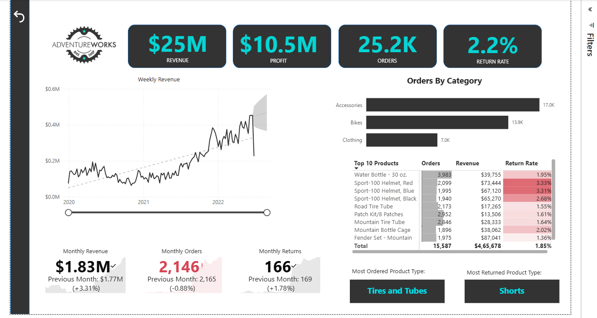
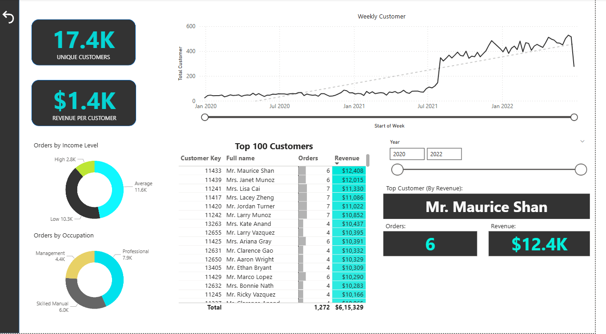
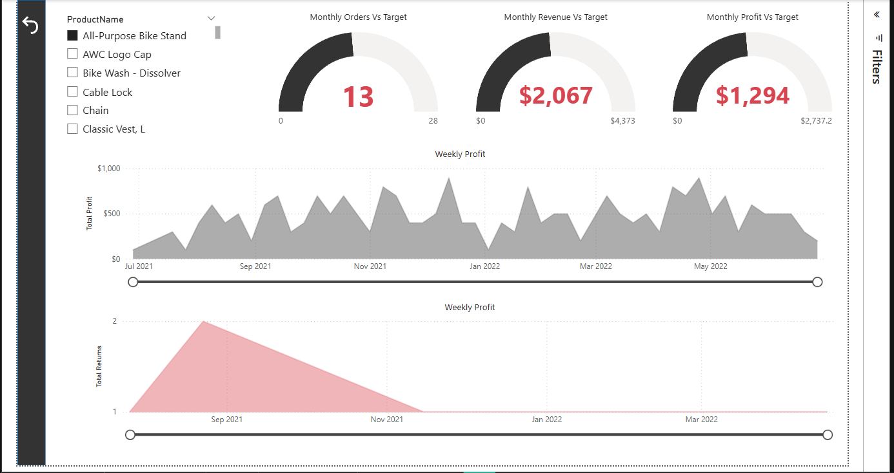
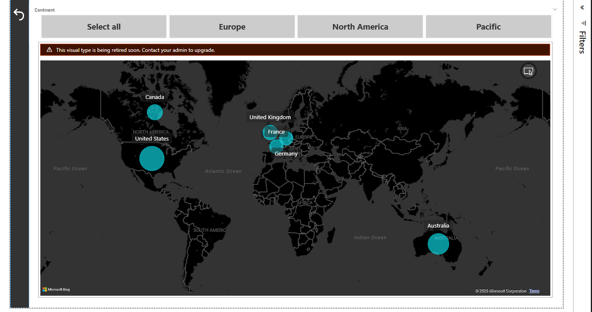

# 📊 Sales Dashboard using Power BI

An interactive Business Intelligence dashboard built using **Microsoft Power BI** to analyze AdventureWorks sales performance. The dashboard provides meaningful insights into revenue, profit, customer behavior, product performance, and regional sales trends through interactive visualizations.

---

##  Project Overview

This project demonstrates the use of **Power BI**, **Power Query**, and **DAX** to transform raw business data into an interactive analytics dashboard for decision-making.

The dashboard enables users to:

- Monitor sales performance
- Analyze customer behavior
- Evaluate product sales
- Compare regional performance
- Track key business KPIs

---

##  Tools & Technologies

- Microsoft Power BI
- Power Query
- DAX (Data Analysis Expressions)
- Microsoft Excel
- Data Visualization

---

##  Project Structure

```
Sales-Dashboard-PowerBI/
│
├── Dashboard/
│   └── Sales_Dashboard.pbix
│
├── datasets/
│   ├── AdventureWorks Sales Data 2020.xlsx
│   ├── AdventureWorks Sales Data 2021.xlsx
│   ├── AdventureWorks Sales Data 2022.xlsx
│   ├── AdventureWorks Customer Lookup.xlsx
│   ├── AdventureWorks Product Lookup.xlsx
│   ├── AdventureWorks Territory Lookup.xlsx
│   ├── AdventureWorks Calendar Lookup.xlsx
│   ├── AdventureWorks Returns Data.xlsx
│   └── ...
│
├── screenshots/
│
├── README.md
└── .gitignore
```

---

#  Dashboard Pages

## Executive Dashboard

Provides a high-level overview of business performance including:

- Revenue
- Profit
- Orders
- Return Rate
- Monthly Trends
- Top Customers
- Top Products

---

## Customer Analysis

Analyze customer purchasing behavior through:

- Customer segmentation
- Revenue contribution
- Order frequency
- Top customers
- Customer demographics

---

## Product Analysis

Provides insights into:

- Product performance
- Revenue by category
- Profitability
- Product returns
- Best-selling products

---

## Sales Map

Visualizes sales performance geographically to identify high-performing regions and territories.

---

#  Key KPIs

- Total Revenue
- Total Profit
- Total Orders
- Return Rate
- Monthly Revenue
- Top Customers
- Top Products
- Regional Sales
- Product Category Performance

---

#  Dashboard Screenshots

## Executive Dashboard



---

## Customer Analysis



---

## Product Analysis



---

## Sales Map



---

#  Dataset

This project uses the **AdventureWorks Sales Dataset**, a widely used sample dataset for business intelligence and analytics practice.

The dataset includes:

- Sales Transactions
- Customer Information
- Product Information
- Product Categories
- Sales Territories
- Calendar Data
- Returns Data

---

#  Skills Demonstrated

- Data Cleaning
- Data Modeling
- Power Query
- DAX Measures
- Interactive Dashboard Design
- KPI Development
- Business Intelligence
- Data Visualization
- Sales Analytics

---

#  Future Improvements

- Forecasting using Power BI
- Customer Lifetime Value Analysis
- Inventory Dashboard
- Profitability Dashboard
- AI-powered Insights
- Drill-through Reports

---

## Author 

**Vibha Jaikanthan**

AI & ML Undergraduate | Data Analytics Enthusiast

GitHub: https://github.com/vibhajaikanthan